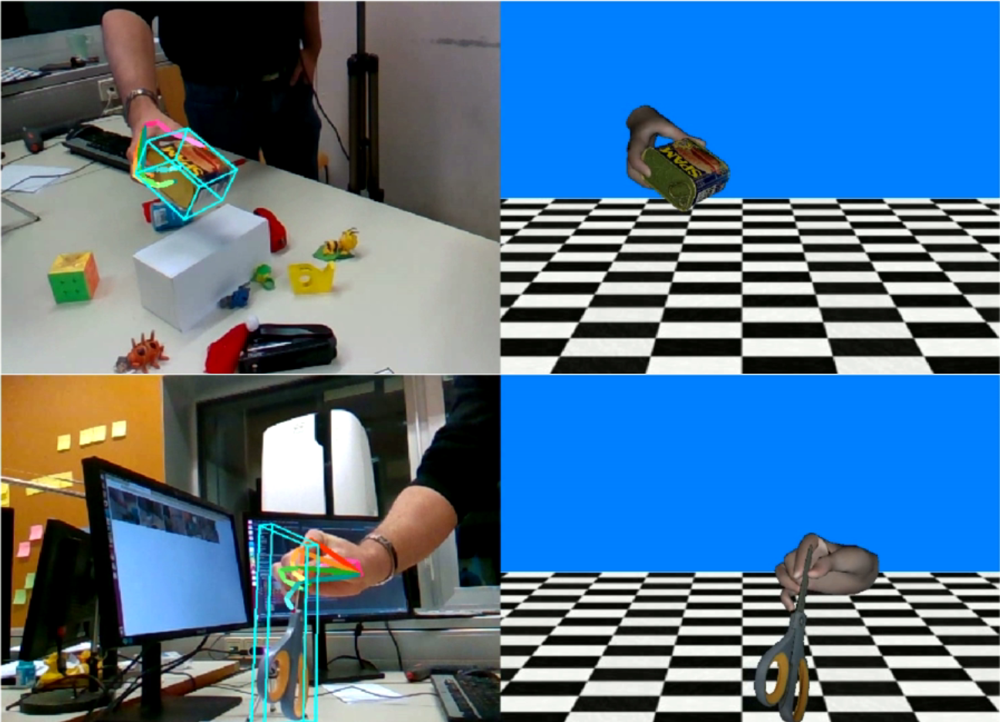

# HO3D - scripts



HO3D is a dataset with 3D pose annotations for hand and object under severe occlusions from each other. The sequences in the dataset contain different
persons manipulating different objects, which are taken from [YCB dataset](https://rse-lab.cs.washington.edu/projects/posecnn/). Details about the 
proposed annotation method can be found in our [paper](https://arxiv.org/pdf/1907.01481). The dataset contains 77558 annotated images and their 
corresponding depth maps.

For more details about the dataset and the corresponding work, visit our [project page](https://www.tugraz.at/institutes/icg/research/team-lepetit/research-projects/)

An online codalab challenge which provides a platform to evaluate different hand pose estimation methods on our dataset with standard metrics is launched 
[here](https://competitions.codalab.org/competitions/22485?secret_key=756c1c8c-84ec-47ec-aa17-42f1fa330fb4) 

This repository contains a collection of scripts for:
* Visualization of HO3D dataset
* Evaluation scripts used in the challenge


# Basic setup

1. Install basic requirements:
    ```
    conda create -n python2.7 python=2.7
    source activate python2.7
    pip install numpy matplotlib scikit-image transforms3d tqdm opencv-python cython pickle
    ```
2. Download Models&code from the MANO website
    ```
    http://mano.is.tue.mpg.de
    ```
3. Assuming ${MANO_PATH} contains the path to where you unpacked the downloaded archive use the provided script to setup the MANO folder as required.
    ```
    python setup_mano.py ${MANO_PATH}
    
4. Download the YCB object models by clicking on `The YCB-Video 3D Models` in [https://rse-lab.cs.washington.edu/projects/posecnn/]. Assume ${YCB_PATH}
is the path where you unpacked the object models into (path to where _models_ folder branches off)

5. Download the HO3D dataset. See project page for instructions. 
    
6. Assuming ${DB_PATH} is the path to where you unpacked the dataset (path to where _./train/_ and _./evaluation/_ folder branch off), 
This should enable you to run the following to show some dataset samples.
    ```
    python vis_HO3D.py ${DB_PATH} ${YCB_PATH}
    python vis_HO3D.py ${DB_PATH} ${YCB_PATH} -split 'evaluation'
    python vis_HO3D.py ${DB_PATH} ${YCB_PATH} -visType 'open3d' 
    ```
    
The script provides parameters to visualize the annotations in 3D using open3d or in 2D in matplotlib window. Use `-visType` to set the visualization type.
The script also provides parameters to visualize samples in the training and evaluation split using the parameters `-split`.


# Evaluate on the dataset

In order to have consistent evaluation of the hand pose estimation algorithms on HO3D dataset, evaluation is handled through CodaLab competition.
 
1. Make predictions for the evaluation dataset. The code provided here predicts zeros for all joints and vertices.
    ```
    python pred.py ${DB_PATH}
    ```
     
2. Zip the `pred.json` file
    ```
    zip -j pred.zip pred.json
    ```
    
3. Upload `pred.zip` to our [Codalab competition](https://competitions.codalab.org/competitions/2dsd) website (Participate -> Submit)

4. Wait for the evaluation server to report back your results and publish your results to the leaderboard. The zero predictor will give you the following results
    ```
    Mean joint error 56.87cm
    Mean joint error (procrustes alignment) 5.19cm
    Mean joint error (scale and trans alignment) NaN
    Mesh error 57.12cm
    Mesh error (procrustes alignment) 5.47cm
    F@5mm=0.0, F@15mm=0.0
    F_aliged@5mm= 0.000, F_aligned@15mm=0.017
    ```
    
5. Modify `pred.py` to use your method for making hand pose estimation and see how well it performs compared to the baselines. Note that the pose
estimates need to be in **OpenGL** coordinate system (hand is along negative z-axis in a right-handed coordinate system with origin at camera optic center)
during the submission. 

6. The calculation of the evaluation metrics can be found in `eval.py`
 
# Terms of use

The download and use of the dataset is for academic research only and it is free to researchers from educational or research institutes
for non-commercial purposes. When downloading the dataset you agree to (unless with expressed permission of the authors): 
not redistribute, modificate, or commercial usage of this dataset in any way or form, either partially or entirely. 
If using this dataset, please cite the corresponding paper.
    ```
	@ARTICLE{hampali2019honnotate,
    	      title={HOnnotate: A method for 3D Annotation of Hand and Objects Poses},
              author={Shreyas Hampali and Mahdi Rad and Markus Oberweger and Vincent Lepetit},
              year={2019},
              eprint={1907.01481},
              archivePrefix={arXiv},
              primaryClass={cs.CV}
             }
    ```
# Acknowledgments

1. The evaluation scripts used in the HO3D challenge have been mostly re-purposed from [Freihand challenge](https://github.com/lmb-freiburg/freihand). We
thank the authors for making their code public.

2. This work was supported by the Christian Doppler Laboratory for Semantic 3D Computer Vision, funded in part
by Qualcomm Inc
